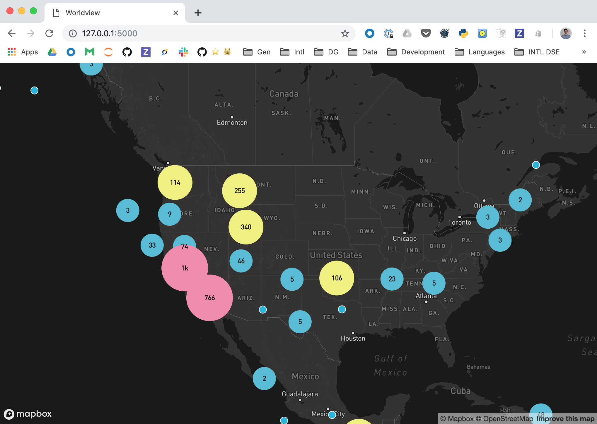
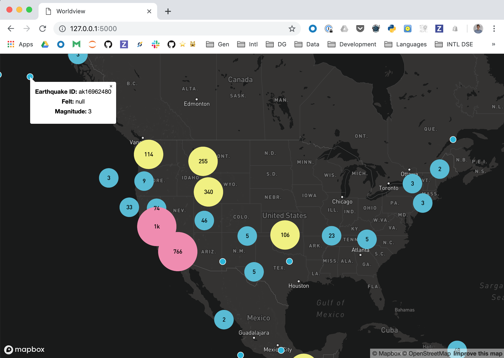

# Mapbox Clustering

Bear bones flask app that visualizes earthquake data and displays popups when points are clicked.



Display a popup on point click:



## Usage

```bash
export MAPBOX_TOKEN=<your_token>
pip install Flask==1.0.2
pip install geojson==2.4.1
python app.py
```

*Note:* Tested on Python 3.7.

## Resources

- https://docs.mapbox.com/mapbox-gl-js/example/cluster/
- https://docs.mapbox.com/mapbox-gl-js/example/popup-on-click/
- https://docs.mapbox.com/mapbox-gl-js/assets/earthquakes.geojson